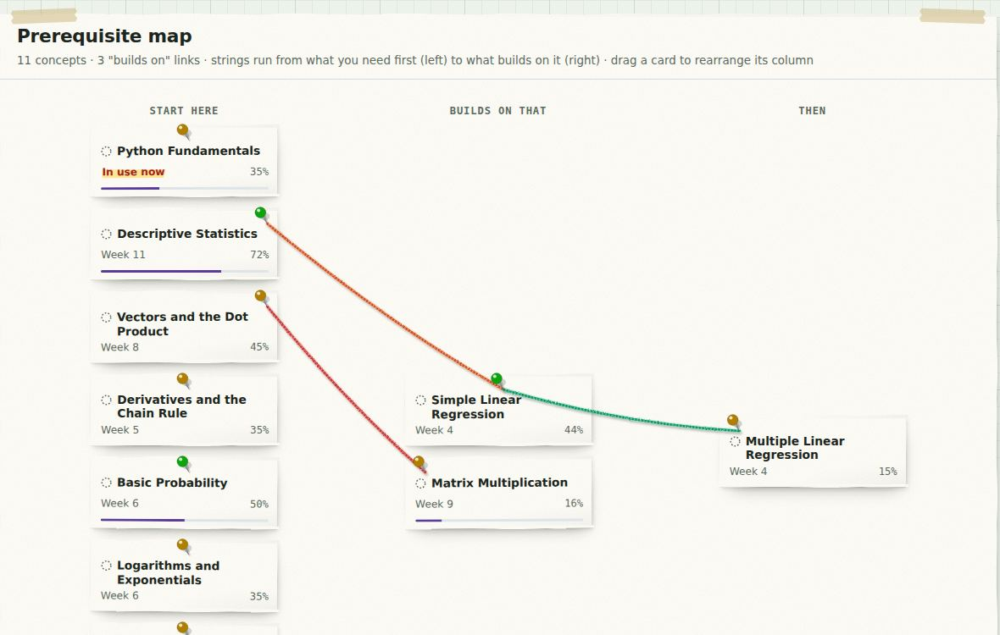
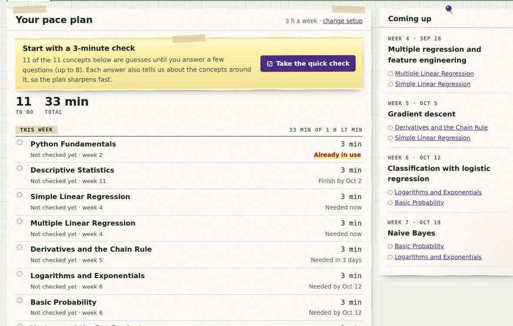
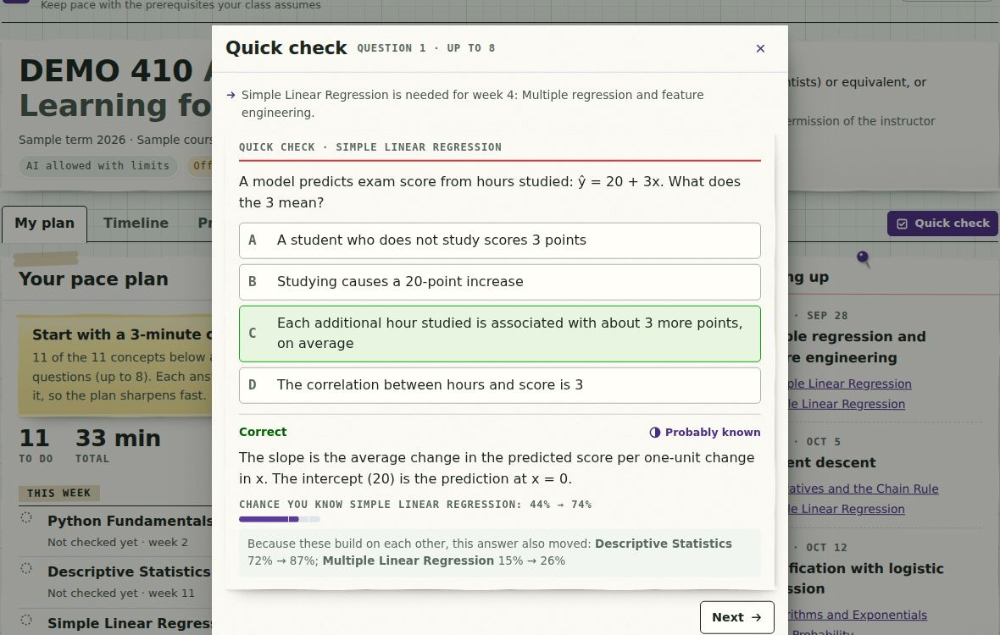
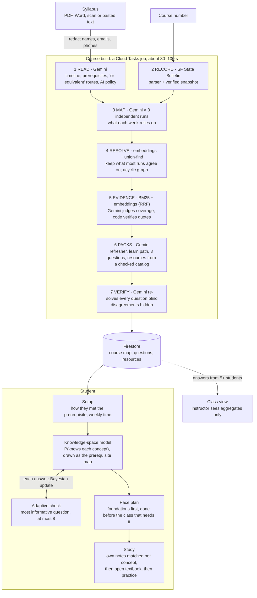
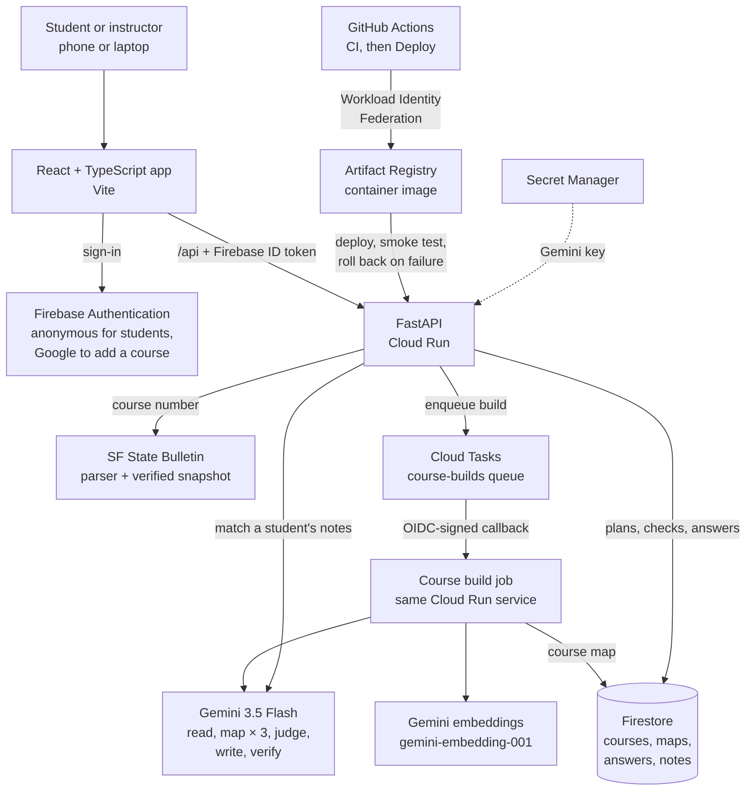

# Throughline

**Keep pace with the prerequisites your class assumes.**
Throughline reads an SF State syllabus and the University Bulletin, maps the earlier-course knowledge each week relies on, checks a student in a few adaptive questions, and schedules what to review before the class that needs it.

**SF Hacks × GDG AI Hackathon 2026 · Build for SFSU track**

| | |
|---|---|
| **Live app** | https://throughline-96823963383.us-central1.run.app |
| **How it works** (workflow, algorithms, formulas, live demo) | https://throughline-96823963383.us-central1.run.app/#/how |
| **Try it in 30 seconds** | Open the live app → **Try the sample course** (fictional course, simulated class, no account needed) |
| **Watch it run** | The How it works page opens with an auto-playing walkthrough of the app, an animated pipeline and the full tech stack |



---

## The problem

Prerequisites certify that a student is ready. At SF State, many students arrive without what the course assumes:

- **"Or equivalent", waivers and instructor permission** let students in without the material. A Bulletin entry can say a prerequisite teaches regression, while a student who came in another way has never seen it.
- **Some courses assume things no prerequisite teaches.** One SF State syllabus we tested tells students they don't need calculus, yet an early week derives backpropagation, which runs on the chain rule.
- **A summer off** erases much of a spring course before the fall course that builds on it.

Nobody sees the gap until the student is already behind.

## What it does

1. **Maps the course.** Each week (or each quiz, when there's no weekly schedule) is linked to the prior knowledge it uses, and concepts are linked to what they build on.
2. **Answers "was this taught?"** Each concept is *taught in* a listed prerequisite (with the quoted line), *probably from* one, *not in listed prerequisites*, or *not confirmed*. When a course accepts alternatives ("DS 110 or MATH 108 or MATH 226"), only the one the student took counts.
3. **Checks the student in at most 8 questions.** Each question is the one expected to tell us the most; one answer also moves the concepts around it.
4. **Builds a pace plan.** Foundations come first, everything is finished before the class that needs it, and it fits the student's weekly time. If it can't fit, the plan says what is short and by how many minutes, and points to tutoring.
5. **Says where to learn each thing.** First the student's own notes or slides from the prerequisite, or from the course they took instead, even at another university (the exact page or slide), then a free open-textbook section, a refresher and practice.
6. **Class view (optional).** Classmates join with a code or QR. The instructor sees aggregates only, and only once 5 or more students have answered.

| The pace plan | The quick check |
|---|---|
|  |  |

## How it works

**Gemini reads and proposes; code decides.** Every number a student sees comes from code that can be tested. The live [How it works page](https://throughline-96823963383.us-central1.run.app/#/how) shows each step, each formula with its constants, and an interactive version of the student model.



| Algorithm | What it does | Code |
|---|---|---|
| **Self-consistency mapping** | A concept is kept if at least ⌈3/2⌉ of 3 independent runs propose it; agreement is its confidence | `mapping.py` |
| **Entity resolution** | Cosine similarity of Gemini embeddings: merge ≥ 0.93, ask Gemini in [0.82, 0.93); union-find clusters | `graph.py` |
| **Hybrid retrieval** | BM25 (k₁ = 1.4, b = 0.75) + embeddings, fused with reciprocal rank fusion (k = 60); a quote counts only if ≥ 60% of its words are in the cited passage | `retrieval.py` |
| **Knowledge Space Theory** | Possible states are the prerequisite-closed sets; Bayesian update per answer with slip 0.10 and guess 0.25; P(concept) is the mass of the states that contain it | `mastery.py` |
| **Adaptive check** | Next question = maximum expected information gain over concepts needed in the next 3 weeks; stop below 0.02 bits or at 8 questions | `assessment.py` |
| **Precedence-aware scheduling** | d′(u) = min(d(u), d′(v) − ⌈t(v)/(B/7)⌉) along the graph, then earliest-deadline-first into the weekly budget B | `readiness.py` |
| **Privacy** | Class aggregates hidden below 5 students (k-anonymity) | `heatmap.py` |

## Architecture

One Cloud Run service serves both the React app and the FastAPI backend. Course builds run as Cloud Tasks jobs, so a build survives restarts and redeploys. Without a Gemini key, an offline engine (keyword heuristics) takes over.



## Built on Google

| | |
|---|---|
| **Gemini 3.5 Flash** | Reads syllabi (including scans), maps prerequisites in three independent runs, judges coverage from retrieved passages, writes study material, re-solves answer keys blind |
| **Gemini embeddings** (`gemini-embedding-001`) | Merges differently named concepts; ranks evidence passages |
| **Cloud Run** | Serves the app and API; startup and liveness probes |
| **Firestore** | Courses, maps and answers, one partition per course |
| **Cloud Tasks** | Durable, retried course builds with OIDC-signed callbacks |
| **Firebase Authentication** | Anonymous sign-in for students; Google sign-in to add a course |
| **Secret Manager · Artifact Registry · Cloud Build** | Gemini key; container images |
| **Workload Identity Federation** | GitHub Actions deploys with no stored keys; failed smoke tests roll back automatically |
| **Cloud Logging · Error Reporting · Monitoring** | Structured logs with request ids, grouped errors, uptime alert |

## Results

We scored the full pipeline on four real SF State syllabi against hand-written labels (`backend/scripts/evaluate.py`, labels in `backend/eval/gold/`):

| Gemini 3.5 Flash, 3 mapping runs | Recall | Precision | F1 | First-needed week (±1) | Model calls | Time |
|---|---|---|---|---|---|---|
| Mean of 4 syllabi | **0.92** | **0.79** | **0.84** | 0.75 | ~20 per course | 80–100 s |
| Offline baseline (keyword heuristics, no Gemini) | 0.52 | 0.96 | 0.57 | | 0 | |

- **Recall is high:** CSC 411 catches the chain rule and matrix multiplication its backpropagation weeks need, although the syllabus says no calculus is required.
- **The harness found our worst bug.** The first mapping prompt told Gemini to skip topics the course teaches, so it also dropped the math under them (recall 0.42). Rewriting the prompt raised recall to 0.92.
- The labels are drafts written by the team; Gemini's output varies a little between runs (F1 0.82–0.84 over two runs).

## Responsible AI

- **No student Canvas credentials.** SF State disabled student API tokens, and Canvas's policy forbids collecting them. The real Canvas path is an LTI tool reviewed by Academic Technology.
- **Syllabi are course materials.** Instructor names, emails and phones are removed before storage or any AI call. Real syllabi are never committed.
- **Each course's AI policy is shown**, and Throughline only reviews prerequisite concepts, never graded work.
- **Uncertainty is visible:** estimates are probabilities with a plain-language basis, coverage has four levels, and disputed questions stay hidden.
- **Students stay anonymous**, see only their own answers, and can delete them. Uploaded notes are private to the student.

## Challenges we ran into

- **Syllabi come in every shape:** dated weekly tables, undated weeks, only quiz dates, or none at all. The timeline is labeled with how it was derived so students know how much to trust the dates.
- **One Gemini run isn't reliable enough** to build a graph students act on. Three independent runs with majority voting, plus verified quotes, made the map trustworthy.
- **Proving "taught in the prerequisite"** needed evidence, not a guess, hence hybrid retrieval and quote checking.

## What we learned

- Measure before believing: the evaluation harness, not intuition, found the prompt bug that halved recall.
- Prerequisite graphs make adaptive testing efficient: one answer informs the concepts around it, so a few questions are enough to place a student.

## What's next

1. A one-course pilot with a willing SF State instructor.
2. Class view for the Tutoring and Academic Support Center's drop-in topics.
3. An LTI 1.3 Canvas tool reviewed by Academic Technology.
4. Department reports of prerequisite gaps across a course sequence.

## Run it locally

Requires Python 3.11+ and Node 20+.

```bash
cd backend && python -m venv .venv && source .venv/bin/activate
pip install -r requirements-dev.txt
export GEMINI_API_KEY=...        # optional: without it the app runs in offline mode
cd ../frontend && npm ci && npm run build
cd ../backend && uvicorn throughline.api:app --port 8080
```

Open http://localhost:8080 and choose **Try the sample course**. Tests: `cd backend && pytest -q` (60 pass). Full setup, deployment and the demo-day script are in **[docs/GUIDE.md](docs/GUIDE.md)**; the visual design is described in [DESIGN.md](DESIGN.md).

## Repository

```
backend/throughline/   FastAPI app and the pipeline (mapping, graph, retrieval, mastery, assessment, readiness)
backend/eval/          gold labels for the evaluation harness
backend/scripts/       evaluate.py, try_syllabus.py, check_links.py
frontend/src/          React + TypeScript (Vite); pages/HowItWorks.tsx is the demo page
deploy/                one-time Google Cloud setup and monitoring
.github/workflows/     CI and deploy to Cloud Run
```

## Team

Built for SF Hacks 2026 by [@shokhabbos-mukhammatov](https://github.com/shokhabbos-mukhammatov) and team.

*Student project. Not affiliated with or endorsed by SF State.*
